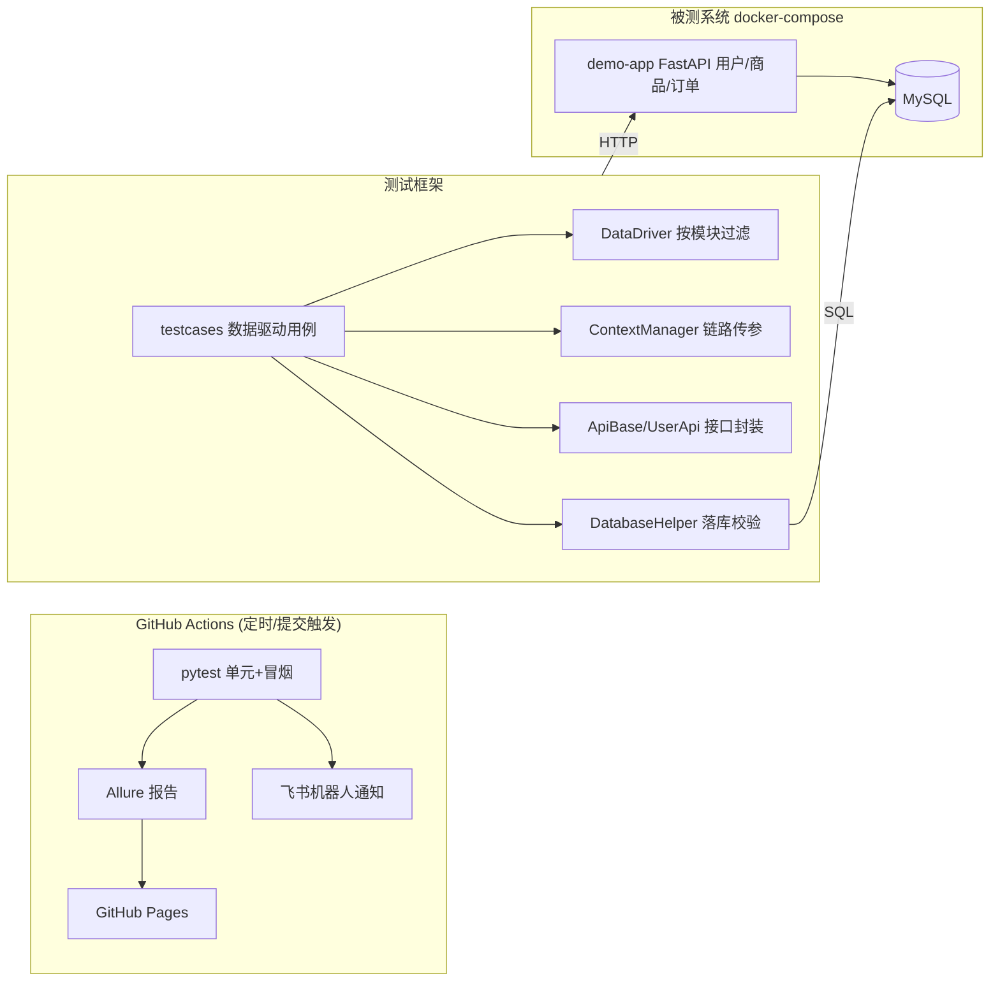

# 基于Pytest的微服务接口自动化测试框架


一个**开箱即可运行**的接口自动化测试框架:自带 FastAPI 被测演示服务与 MySQL,`docker compose up` 一键拉起完整测试环境,覆盖"登录 → 创建订单 → 查询订单 → 库存校验"核心业务链路,演示 YAML 数据驱动、链路上下文传参、接口/落库双重校验与 CI 自动化闭环。

## 核心特性

- **分层架构**:`api` 接口封装 / `core` 驱动核心 / `data` 配置数据 / `utils` 工具,职责单一
- **数据驱动**:YAML 用例在收集阶段按模块过滤注入,一条方法 = N 条用例,数据与代码完全解耦
- **链路传参**:用例通过 `extract` 段按 JSONPath 提取响应字段写入上下文,后续用例以 `${context.user_id}` 占位符引用;缺失变量在请求发出前快速失败
- **双重校验**:JSONPath 响应断言 + 业务码断言 + MySQL 落库断言
- **安全重试**:网络重试仅作用于幂等方法,POST 不自动重试,避免重复下单类脏数据
- **安全与隔离**:报告自动脱敏、资源归属校验、库存原子扣减,订单用例按测试造数并回收
- **框架自测**:72 条单元测试覆盖渲染、配置、数据模型、DB、通知、脱敏和演示服务安全边界
- **工程化闭环**:Docker Compose + GitHub Actions 定时巡检 + Allure 报告发布至 GitHub Pages + 飞书机器人推送结果

## 架构



## 项目结构

```
├── api/                    # API封装层
│   ├── http_client.py      # HTTP客户端(统一超时/重试,POST不重试)
│   ├── api_base.py         # 业务API基类(鉴权注入/业务码处理)
│   └── user_api.py         # 用户模块API(前置登录/用户信息)
├── core/                   # 核心驱动层
│   ├── data_driver.py      # 数据驱动(收集阶段按模块过滤)
│   ├── context_manager.py  # 链路上下文(${key}渲染/extract写入)
│   └── test_case_base.py   # 测试基类(统一执行流/四类断言)
├── data/                   # 数据管理层
│   ├── config_manager.py   # 多环境配置(${VAR:默认值}注入)
│   └── data_manager.py     # YAML用例加载与校验
├── utils/                  # 工具层
│   ├── jsonpath_extractor.py / db_helper.py / logger.py
│   ├── reporter.py / feishu_notifier.py / exceptions.py
├── demo_app/               # 被测演示服务(FastAPI + MySQL)
├── testcases/              # 冒烟用例(用户→订单→商品 链路)
├── unit_tests/             # 框架自身单元测试(无外部依赖)
├── config/
│   ├── env_config.yaml     # 多环境配置
│   └── test_data.yaml      # 数据驱动用例
├── docker-compose.yml      # 被测服务+MySQL+执行器
└── .github/workflows/      # CI流水线
```

## 快速开始

### 方式一:Docker Compose 一键运行

```bash
docker compose up -d --build   # 拉起 MySQL + 被测演示服务
pytest                          # 宿主机执行(默认连 localhost:8000 / localhost:3306)
docker compose run --rm test-runner   # 或容器内执行
```

### 方式二:使用 uv 隔离本地环境

在项目根目录执行以下命令。uv 会创建 Python 3.11 的 `.venv` 并使用该环境运行命令，无需手动激活。已有其他版本的 `.venv` 时，先备份再创建；依赖由 requirements 与 constraints 文件管理。

```bash
uv venv --python 3.11 .venv
uv pip install -c constraints.txt -r requirements.txt -r demo_app/requirements.txt
uv run python --version
uv run pytest -m unit                 # 无需启动外部服务
docker compose up -d mysql demo-app    # 仅拉起依赖
uv run pytest
```

常用命令:

```bash
uv run pytest -m smoke                # 只跑冒烟链路
uv run pytest -m unit                 # 只跑框架单元测试
uv run pytest --env=dev               # 指定环境(TEST_ENV 环境变量亦可)
uv run pytest --alluredir=reports/allure && allure serve reports/allure
```

无需任何手工配置:数据库连接、服务地址均带默认值(`config/env_config.yaml` 中 `${VAR:默认值}`),需要覆盖时注入同名环境变量即可。

## 数据驱动用例示例

```yaml
- case_id: "TC004"
  name: "创建订单"
  feature: "订单模块"
  story: "订单创建"
  request:
    method: "POST"
    url: "/api/orders"
    data:
      user_id: "${context.user_id}"     # 引用登录用例提取的链路参数
      product_id: 1002
      quantity: 2
  expected:
    status_code: 200
    business_code: 0
  validation:
    jsonpath: {expr: "$.data.status", value: "created"}
    database:
      table: "orders"
      conditions: {user_id: "${context.user_id}"}
      expected: {status: "created", product_id: 1002}
  extract:
    order_id: "$.data.order_id"          # 写入上下文供后续用例使用
```

## 设计决策

| 决策 | 理由 |
|------|------|
| 用例过滤在收集阶段完成,而非运行时 skip | 避免"加一条数据全体测试方法膨胀"的问题,Allure 中无噪音 skip |
| API 对象层 + 数据驱动并存 | 数据驱动覆盖参数化业务断言;API 对象层负责前置登录、造数等流程编排 |
| 整串占位符渲染保留原始类型 | `${context.user_id}` 直传 int,SQL/JSON 不会出现 `"1001"` 类型歧义 |
| POST 不自动重试 | 重试只对幂等方法生效,防止创建订单类接口因重试产生重复数据 |
| 订单数据按用例创建和回收 | 避免全表清理与执行顺序依赖,单条用例可独立运行 |
| 报告写入前递归脱敏 | 防止密码、Token、Cookie 等进入 Allure 与 Pages |
| 内置被测演示服务 | 框架克隆即可运行,不依赖外部环境;同时演示落库断言的真实价值 |

## CI/CD

GitHub Actions 在 push/PR/工作日定时触发:

1. 启动 MySQL 服务容器 + FastAPI 演示服务;
2. 执行单元 + 冒烟双层测试,输出核心层覆盖率;
3. Allure 报告发布至 GitHub Pages,飞书机器人推送执行结果(配置 `FEISHU_WEBHOOK` Secret 后生效)。

## 许可证

MIT
