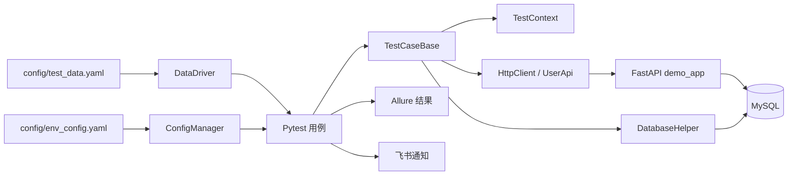

# 接口自动化测试框架设计说明

> 文档状态：当前实现基线
>
> 最后校对：2026-10-07
>
> 适用范围：仓库 `main` 分支

## 1. 目标与非目标

### 1.1 目标

本项目提供一个最小但完整的接口自动化测试闭环：

- 测试数据与测试代码分离；
- 支持跨接口参数提取和引用；
- 同时校验 HTTP、业务响应和数据库状态；
- 本地、容器和 CI 使用同一套配置模型；
- 报告与通知能够解释测试执行结果；
- 框架核心逻辑具备独立单元测试。

### 1.2 非目标

当前版本不定位为通用测试平台，也不包含 UI 自动化、性能测试、服务虚拟化、分布式调度、生产流量回放或测试管理系统。演示服务用于验证框架能力，不是生产应用模板。

## 2. 总体架构



### 2.1 依赖方向

```text
testcases
  ├─> api
  ├─> core
  ├─> data
  └─> utils

core ─> utils
data ─> utils
api  ─> utils
```

`demo_app` 是被测对象，不能反向依赖测试框架。`utils` 保持底层工具定位，避免引用测试用例或业务 API 对象。

## 3. 模块设计

### 3.1 HTTP 与 API 对象层

`api/http_client.py` 负责：

- 维护 `requests.Session`；
- 拼接基础 URL；
- 应用默认请求头和超时；
- 对 HEAD、GET、PUT、DELETE、OPTIONS 等幂等方法重试；
- 记录请求方法、地址和响应状态码。

POST 默认不重试，因为框架无法判断被测接口是否实现幂等键。

`api/api_base.py` 在 HTTP 客户端之上提供 Bearer Token 注入和统一业务响应处理。`api/user_api.py` 是业务 API 对象示例，用于登录及用户资料查询。

数据驱动与 API 对象不是互斥方案：前者适合批量参数和声明式断言，后者适合前置造数、鉴权和多步骤流程编排。

### 3.2 配置管理

`ConfigManager` 加载 `config/env_config.yaml`，先合并 `common` 与所选环境，再解析 `${ENV_NAME:default}` 形式的环境变量。

环境选择顺序：

1. 命令行 `--env`；
2. `TEST_ENV`；
3. 默认环境 `test`。

仓库只提供 `test` 和 `dev` 演示配置，不提供默认生产配置，避免误连真实生产系统。

### 3.3 测试数据管理

`DataManager` 是 YAML 用例的唯一读取入口，负责：

- 根据项目根目录解析相对路径；
- 使用 `yaml.safe_load`；
- 检查基础字段；
- 按 feature、story 或 case_id 查询用例。

`DataDriver.parametrize` 在 Pytest 收集阶段过滤用例，再生成参数化标记。这样不会为每个测试方法生成无关用例后再跳过。

### 3.4 上下文管理

`TestContext` 保存运行时数据，并递归渲染字符串、字典和列表：

```yaml
user_id: "${context.user_id}"
description: "order-${order_id}"
```

完整占位符会保留值的原始类型，例如整数用户 ID 不会变为字符串。当前缺失值会保留原占位符；后续版本计划改为可配置的快速失败。

### 3.5 统一用例执行

`TestCaseBase.run_data_driven_case` 的顺序固定为：

```text
渲染请求
  → 发送请求
  → 校验 HTTP 状态码
  → 校验业务码
  → 校验 JSONPath
  → 校验数据库
  → 提取响应字段到上下文
```

统一执行入口保证 YAML 字段在不同业务模块中语义一致，并集中生成 Allure 步骤与附件。

### 3.6 数据库工具

`DatabaseHelper` 使用惰性连接，提供查询、更新、单记录读取和字段比对。SQL 值通过参数绑定传递；表名和列名当前由受信任的测试配置提供。

它只用于测试验证和数据准备，不承担业务服务的数据访问职责。

### 3.7 报告与通知

Allure 记录请求、响应和断言步骤。`pytest_sessionfinish` 汇总 Pytest 结果，在设置 `FEISHU_WEBHOOK` 时发送飞书卡片；未配置时静默跳过。

接入真实环境前必须对请求头、密码、Token、Cookie 和个人数据进行脱敏。报告是测试产物，不应被视为天然安全。

## 4. YAML 用例模型

```yaml
test_cases:
  - case_id: "TC004"
    name: "创建订单"
    feature: "订单模块"
    story: "订单创建"
    request:
      method: "POST"
      url: "/api/orders"
      data:
        user_id: "${context.user_id}"
        product_id: 1002
        quantity: 2
    expected:
      status_code: 200
      business_code: 0
    validation:
      jsonpath:
        expr: "$.data.status"
        value: "created"
      database:
        table: "orders"
        conditions:
          user_id: "${context.user_id}"
        expected:
          status: "created"
          product_id: 1002
    extract:
      order_id: "$.data.order_id"
```

### 4.1 字段语义

| 字段 | 必需 | 说明 |
|------|------|------|
| `case_id` | 是 | 全局可识别的用例编号 |
| `name` | 建议 | 报告中的可读名称 |
| `feature` / `story` | 建议 | 用例过滤和报告分类 |
| `request.method` | 是 | HTTP 方法 |
| `request.url` | 是 | 相对或绝对 URL |
| `request.data` | 否 | 作为 JSON 请求体发送 |
| `request.params` | 否 | 查询参数 |
| `expected.status_code` | 是 | HTTP 状态码期望值 |
| `expected.business_code` | 否 | 统一响应包中的 `code` |
| `validation.jsonpath` | 否 | JSONPath 命中及值校验 |
| `validation.database` | 否 | 单条数据库记录字段校验 |
| `extract` | 否 | JSONPath 到上下文键的映射 |

`validation.jsonpath.value: null` 表示只校验路径存在，不比较值。

## 5. Fixture 生命周期

| Fixture | 作用域 | 职责 |
|---------|--------|------|
| `config` | session | 加载所选环境配置 |
| `api_client` | session | 提供未鉴权 API 客户端 |
| `auth_client` | session | 登录并配置 Bearer Token |
| `chain_context` | session | 保存当前链路的 token、user_id、order_id |
| `db_helper` | session | 复用数据库连接并在结束时关闭 |
| `reset_test_data` | session/autouse | 执行前重置演示订单与库存 |

会话级上下文适合展示跨用例参数传递，但带来顺序和并行限制。长期设计应让普通用例独立，把真正的端到端链路放在单个场景中完成。

## 6. 被测演示服务

### 6.1 接口

| 方法 | 路径 | 说明 | 鉴权 |
|------|------|------|------|
| GET | `/health` | 健康检查 | 否 |
| POST | `/api/login` | 登录并签发 JWT | 否 |
| GET | `/api/users/{user_id}` | 查询用户资料 | 是 |
| PUT | `/api/users/{user_id}` | 更新本人资料 | 是 |
| GET | `/api/products/{product_id}` | 查询商品和库存 | 否 |
| POST | `/api/orders` | 创建订单并扣减库存 | 是 |
| GET | `/api/orders?user_id=` | 查询本人订单 | 是 |

响应统一为：

```json
{
  "code": 0,
  "message": "success",
  "data": {}
}
```

业务错误沿用 HTTP 200，通过非零 `code` 表达。这是本演示项目的约定，并非对所有真实 API 的推荐。

### 6.2 数据库

演示服务初始化 `users`、`products` 和 `orders` 三张表，并写入测试用户与商品。数据库默认映射到宿主机 `3307`，避免与常见的本地 `3306` 冲突。

当前订单库存逻辑是“读取后更新”，尚未提供生产级并发保护；设计改进见[升级路线图](../../升级计划书.md)。

## 7. 运行拓扑

### 7.1 宿主机执行

```text
pytest ──HTTP──> localhost:8000  demo-app
   └────MySQL──> localhost:3307  mysql
```

### 7.2 Compose 内执行

```text
test-runner ──HTTP──> demo-app:8000
     └───────MySQL──> mysql:3306
```

Compose 通过健康检查保证 MySQL 就绪后启动演示服务，再在演示服务就绪后启动测试执行器。

## 8. CI 流程

GitHub Actions 在 push、pull request、工作日定时任务和手动触发时运行：

1. 启动 MySQL service container；
2. 安装框架和演示服务依赖；
3. 启动 FastAPI 演示服务并等待健康检查；
4. 运行 unit 与 smoke 测试并生成覆盖率；
5. 生成 Allure 报告；
6. 发布 GitHub Pages；
7. 配置 Webhook 时发送飞书通知。

定时任务中的 cron 使用 UTC。`0 8 * * 1-5` 对应北京时间工作日 16:00，而不是上午 8:00。

## 9. 扩展指南

### 9.1 新增业务模块

1. 在 `api/` 添加需要复用的流程方法；
2. 在 YAML 中添加 feature/story 和数据；
3. 在 `testcases/` 创建对应测试类并按模块过滤；
4. 为新增的框架逻辑补充 `unit_tests/`；
5. 涉及状态变化时增加数据库断言和清理逻辑。

### 9.2 新增断言类型

断言实现应放在 `TestCaseBase` 或独立断言模块，并满足：

- YAML 语义明确；
- 失败信息包含期望值、实际值和定位上下文；
- 不修改被测系统状态；
- 有独立单元测试；
- 在 Allure 中形成可读步骤。

### 9.3 新增环境

在 `env_config.yaml` 增加环境段，并通过环境变量注入连接信息。禁止提交真实密码，也不要为生产环境提供可直接运行的默认值。

## 10. 已知限制与设计债务

| 问题 | 影响 | 计划 |
|------|------|------|
| 跨用例会话上下文依赖顺序 | 单测选择、随机顺序、并行执行不稳定 | 改为 fixture 造数和场景内链路 |
| 演示接口资源归属检查不完整 | 存在越权演示缺陷 | 强制使用 Token 主体并补权限测试 |
| 库存扣减非原子 | 并发下单可能超卖 | 条件更新或行锁 |
| Allure 附件未脱敏 | 可能泄露密码和 Token | 统一递归脱敏 |
| 通知未正确合并 error | CI 错误可能误报成功 | 重构结果汇总模型 |
| YAML 仅做基础结构校验 | 错误可能到运行阶段才暴露 | 引入 schema 校验 |
| 依赖未锁定 | 不同时间安装结果可能不同 | 增加 constraints 或锁文件 |

路线图与验收标准见[升级路线图](../../升级计划书.md)。

## 11. 设计原则

1. **结果可信优先**：测试失败、基础设施错误和通知状态必须一致。
2. **用例默认独立**：除显式端到端场景外，不依赖执行顺序。
3. **安全默认值**：不默认连接生产，不记录未脱敏凭据，不重试非幂等操作。
4. **单一事实来源**：配置读取、YAML 加载和数据库访问各自只有一个入口。
5. **先验证再扩展**：新增功能必须带测试和可复现的使用场景。
